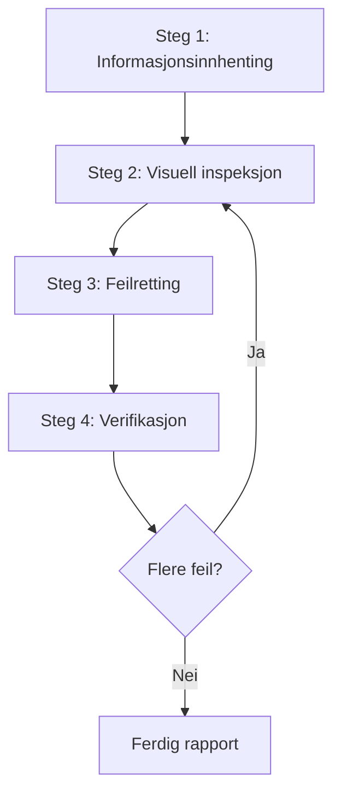

# Nettside-designgjennomgang

Visuell inspeksjon og validering av designkvalitet på nettsider. Identifiserer og fikser problemer på kildekodenivå.

## Anvendelse

- Statiske nettsider (HTML/CSS/JS)
- SPA-rammeverk som React / Vue / Angular / Svelte
- Fullstack-rammeverk som Next.js / Nuxt / SvelteKit
- Andre webapplikasjoner

## Forutsetninger

### Påkrevd

1. **Nettsiden må kjøre**
   - Lokal utviklingsserver (f.eks. `http://localhost:3000`)
   - Staging-miljø
   - Produksjon (kun for gjennomgang uten endringer)

2. **Browser-automatisering må være tilgjengelig**
   - Screenshots
   - Sidenavigasjon
   - DOM-informasjon

3. **Tilgang til kildekode (ved feilretting)**
   - Prosjektet må finnes i workspace

## Arbeidsflyt



---

## Steg 1: Informasjonsinnhenting

### 1.1 URL-bekreftelse

Hvis URL ikke er oppgitt, spør:

> Oppgi URL-en til nettsiden som skal gjennomgås (f.eks. `http://localhost:3000`)

### 1.2 Prosjektstruktur

Ved feilretting, finn ut følgende:

| Element | Eksempel |
|---------|----------|
| Rammeverk | React / Vue / Next.js etc.? |
| Styling | CSS / SCSS / Tailwind / CSS-in-JS? |
| Kildeplassering | Hvor ligger stil- og komponentfiler? |
| Omfang | Spesifikke sider eller hele nettstedet? |

### 1.3 Automatisk prosjektdeteksjon

Forsøk automatisk deteksjon fra filer i workspace:

```
Deteksjonsmål:
├── package.json     → Rammeverk og avhengigheter
├── tsconfig.json    → TypeScript-bruk
├── tailwind.config  → Tailwind CSS
├── next.config      → Next.js
├── vite.config      → Vite
├── nuxt.config      → Nuxt
└── src/ eller app/  → Kildekatalog
```

### 1.4 Identifisering av stilmetode

| Metode | Deteksjon | Redigeringsmål |
|--------|-----------|----------------|
| Ren CSS | `*.css`-filer | Global CSS eller komponent-CSS |
| SCSS/Sass | `*.scss`, `*.sass` | SCSS-filer |
| CSS Modules | `*.module.css` | Modul-CSS-filer |
| Tailwind CSS | `tailwind.config.*` | className i komponenter |
| styled-components | `styled.` i koden | JS/TS-filer |
| Emotion | `@emotion/`-imports | JS/TS-filer |
| CSS-in-JS (annet) | Inline-stiler | JS/TS-filer |

---

## Steg 2: Visuell inspeksjon

### 2.1 Sidetraversering

1. Naviger til oppgitt URL
2. Ta screenshot
3. Hent DOM-struktur/snapshot (hvis mulig)
4. Traverser gjennom navigasjon hvis flere sider finnes

### 2.2 Inspeksjonspunkter

#### Layout-problemer

| Problem | Beskrivelse | Alvorlighet |
|---------|-------------|-------------|
| Overflow | Innhold flyter utenfor forelder eller viewport | Høy |
| Overlapping | Utilsiktet overlapping av elementer | Høy |
| Alignment-feil | Grid- eller flex-alignment-problemer | Middels |
| Inkonsistent spacing | Padding/margin-inkonsistens | Middels |
| Text overflow | Lang tekst håndteres ikke riktig | Middels |

#### Responsive problemer

| Problem | Beskrivelse | Alvorlighet |
|---------|-------------|-------------|
| Ikke mobilvennlig | Layout brekker på små skjermer | Høy |
| Breakpoint-problemer | Unaturlige overganger ved skjermendring | Middels |
| Touch targets | Knapper for små på mobil | Middels |

#### Tilgjengelighetsproblemer

| Problem | Beskrivelse | Alvorlighet |
|---------|-------------|-------------|
| Utilstrekkelig kontrast | Lav kontrastforhold mellom tekst og bakgrunn | Høy |
| Ingen fokustilstand | Kan ikke se fokus ved tastaturnavigasjon | Høy |
| Manglende alt-tekst | Ingen alternativtekst for bilder | Middels |

#### Visuell konsistens

| Problem | Beskrivelse | Alvorlighet |
|---------|-------------|-------------|
| Fontinkonsistens | Blanding av fontfamilier | Middels |
| Fargeinkonsistens | Ikke-enhetlige merkefarger | Middels |
| Spacing-inkonsistens | Ulik spacing mellom like elementer | Lav |

### 2.3 Viewport-testing (responsiv)

Test ved følgende viewports:

| Navn | Bredde | Representativ enhet |
|------|--------|---------------------|
| Mobil | 375px | iPhone SE/12 mini |
| Nettbrett | 768px | iPad |
| Desktop | 1280px | Standard PC |
| Bred | 1920px | Stor skjerm |

---

## Steg 3: Feilretting

### 3.1 Prioritering

| Prioritet | Beskrivelse |
|-----------|-------------|
| P1 | Fiks umiddelbart — Layout-problemer som påvirker funksjonalitet |
| P2 | Fiks snart — Visuelle problemer som forringer UX |
| P3 | Fiks hvis mulig — Mindre visuelle inkonsistenser |

### 3.2 Finne kildefiler

Identifiser kildefiler fra problematiske elementer:

1. **Selektor-basert søk**
   - Søk i kodebasen etter klassenavn eller ID
   - Utforsk stildefinisjoner med `grep_search`

2. **Komponent-basert søk**
   - Identifiser komponenter fra elementtekst eller struktur
   - Utforsk relaterte filer med `semantic_search`

3. **Filmønsterfiltrering**
   ```
   Stilfiler: src/**/*.css, styles/**/*
   Komponenter: src/components/**/*
   Sider: src/pages/**, app/**
   ```

### 3.3 Gjennomføre fiks

Se [references/framework-fixes.md](references/framework-fixes.md) for rammeverksspesifikke retningslinjer.

#### Fiks-prinsipper

1. **Minimale endringer**: Gjør kun nødvendige endringer for å løse problemet
2. **Respekter eksisterende mønstre**: Følg eksisterende kodestil i prosjektet
3. **Unngå breaking changes**: Vær forsiktig så du ikke påvirker andre områder
4. **Legg til kommentarer**: Forklar fiksen der det er relevant

---

## Steg 4: Verifikasjon

### 4.1 Bekreftelse etter fiks

1. Last inn nettleseren på nytt (eller vent på HMR)
2. Ta screenshot av fiksede områder
3. Sammenlign før og etter

### 4.2 Regresjonstesting

- Verifiser at fiksen ikke har påvirket andre områder
- Bekreft at responsiv visning fortsatt fungerer

### 4.3 Iterasjonsbeslutning

**Iterasjonsgrense**: Hvis mer enn 3 fiks-forsøk trengs for ett problem, konsulter brukeren

---

## Rapportformat

### Gjennomgangsresultat

```markdown
# Designgjennomgang — resultater

## Sammendrag

| Element | Verdi |
|---------|-------|
| URL | {URL} |
| Rammeverk | {Detektert rammeverk} |
| Styling | {CSS / Tailwind / etc.} |
| Testede viewports | Desktop, Mobil |
| Problemer funnet | {N} |
| Problemer fikset | {M} |

## Problemer funnet

### [P1] {Problemtittel}

- **Side**: {Sidesti}
- **Element**: {Selektor eller beskrivelse}
- **Problem**: {Detaljert beskrivelse}
- **Fikset fil**: `{Filsti}`
- **Fiks**: {Beskrivelse av endringer}
- **Screenshot**: Før/Etter

### [P2] {Problemtittel}
...

## Ikke-fiksede problemer (hvis aktuelt)

### {Problemtittel}
- **Årsak**: {Hvorfor det ikke ble fikset}
- **Anbefalt handling**: {Anbefalinger til bruker}

## Anbefalinger

- {Forslag til fremtidige forbedringer}
```

---

## Beste praksis

### GJØR

- Ta alltid screenshot før du fikser
- Fiks ett problem om gangen og verifiser hver
- Følg prosjektets eksisterende kodestil
- Bekreft med bruker før store endringer
- Dokumenter fiks-detaljer grundig

### IKKE GJØR

- Stor refaktorering uten bekreftelse
- Ignorere design system eller brand guidelines
- Fikser som ignorerer ytelse
- Fikse flere problemer samtidig (vanskelig å verifisere)
